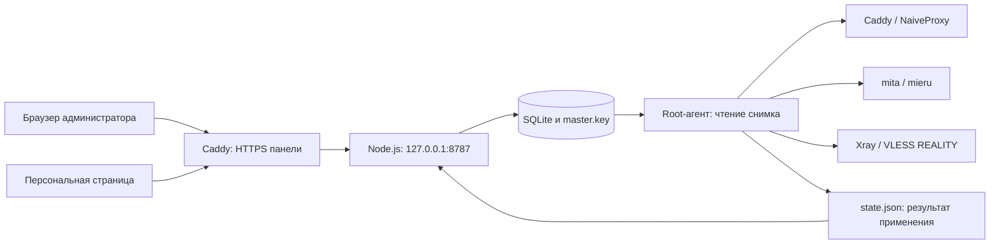

# Архитектура TRIDENT 0.1

[К README](../README.md) · [HTTP API](API.md) · [Проверки](../VALIDATION.md)

Документ описывает реализованный код версии 0.1.0. Он объясняет, какие данные сохраняются, когда доступ начинает действовать и что происходит при сбое применения. Установка и проверка реального подключения описаны в README.

## 1. Общая схема

`Gateway` и `Caddy / NaiveProxy` на схеме — один процесс Caddy с двумя публичными HTTPS-точками. При первичной настройке браузер обращается к backend через localhost или SSH-туннель, поэтому не зависит от работающего сертификата.

SQLite содержит **желаемое состояние**. Генераторы превращают его в три серверных файла. Агент применяет файлы к сервисам и публикует результат. Успешное сохранение пользователя означает запись в базу; успешное применение — отдельное состояние.

## 2. Ответственность модулей

| Файл | Назначение | Почему выделен отдельно |
|---|---|---|
| [`src/domain.mjs`](../src/domain.mjs) | Валидация, секреты, REALITY-ключи, сроки, публичные модели | Одинаковые правила для API, хранилища и генераторов |
| [`src/store.mjs`](../src/store.mjs) | SQLite, AES-GCM, сессии, транзакции, журнал | HTTP-код не собирает SQL и не управляет шифрованием |
| [`src/configs.mjs`](../src/configs.mjs) | Клиентские/серверные конфиги, ревизия, ZIP | Форматы движков находятся в одном месте |
| [`src/server.mjs`](../src/server.mjs) | HTTP, проверка запросов, маршруты, статика | Backend не вызывает systemctl и не запускает shell |
| [`src/agent.mjs`](../src/agent.mjs) | Чтение снимка, цикл применения, Linux-адаптер, откат | Привилегированные операции выполняются отдельным процессом |
| [`public/app.js`](../public/app.js) | Русский интерфейс, формы и персональная страница | Обычный JavaScript без сборки и внешних CDN |
| [`deploy/`](../deploy/) | Установка и пять systemd units | Пути, пользователи и полномочия задаются явно |
| [`scripts/`](../scripts/) | Резервная копия и серверный экспорт | Административные операции доступны без браузера |
| [`test/core.test.mjs`](../test/core.test.mjs) | Автоматические сценарии | Генерация и HTTP проверяются без действующего VPS |

Node.js 24 предоставляет HTTP, криптографию, SQLite и тестовый раннер. ZIP создаётся собственным небольшим генератором без сжатия; в него допускаются только внутренние имена файлов без путей. Это уменьшает установку до исходников и Node, но не заменяет установку трёх прокси-движков.

Для чистого Ubuntu 24.04/amd64 `deploy/bootstrap.sh` скачивает исходники и закреплённые официальные архивы четырёх компонентов, проверяет SHA256 и вызывает локальный `deploy/install.sh`. Установщик копирует Node в `/opt/trident-panel/runtime/node`; оба Node-сервиса используют этот путь, не завися от системного Node. Существующие данные и движки блокируют bootstrap. До настройки администратора запускается только HTTP backend на loopback. Проверка установки вынесена в `.github/workflows/ubuntu-install.yml`; это отдельная проверка от реального внешнего трафика протоколов.

## 3. Модель данных

### Пользователь

Каждая запись имеет UUID `id`, имя `name`, заметку `note`, сохранённый `status`, необязательный `expiresAt`, дату создания `createdAt`, три набора `secrets` и `shareToken`.

- NaiveProxy: логин вида `n_…`, случайный пароль.
- mieru: логин вида `m_…`, другой случайный пароль.
- VLESS: отдельный UUID.
- Персональная выдача: независимый случайный токен из 32 байт в base64url.

Имена не обязаны быть уникальными: связь внутри системы строится по `id`. Порты относятся к настройкам сервера, поэтому создание нового человека не открывает новые слушающие порты. Все пользователи используют одну серверную пару REALITY-ключей и `shortId`; доступ VLESS различается по пользовательскому UUID.

`publicUser()` убирает `secrets` и `shareToken` из обычных ответов API. `publicSettings()` убирает приватный REALITY-ключ. Получение клиентского/серверного комплекта — отдельная операция, которая возвращает необходимые для подключения секреты.

### SQLite

| Таблица | Содержимое | Защита |
|---|---|---|
| `meta` | Настройки и запись администратора | `value` зашифровано AES-256-GCM |
| `users` | UUID и полная запись пользователя | `record` зашифровано AES-256-GCM; UUID открыт |
| `sessions` | Хеш ID сессии, CSRF-токен, время окончания | ID cookie сохраняется как SHA-256; таблица не шифруется целиком |
| `audit` | Время, действие, имя/домен объекта | Открытый журнал без протокольных паролей |

Каждое шифрование создаёт новый 12-байтный IV. Сохранённое значение содержит IV, 16-байтный тег GCM и шифротекст, закодированные в base64. `master.key` содержит 32 байта и хранится рядом с базой отдельно. Потеря ключа делает секретные записи недоступными; обладание базой и ключом позволяет их прочитать.

SQLite работает в WAL-режиме с `busy_timeout=5000`. Изменение пользователя и соответствующая запись журнала выполняются в одной транзакции `BEGIN IMMEDIATE`. Агент открывает базу read-only и читает настройки с пользователями внутри одной транзакции чтения. Поэтому его снимок не смешивает записи до и после одной завершённой записи панели.

Журнал отдаёт последние 80 событий; это ограничение выборки, а не автоматическая очистка таблицы. Аудит не является полным журналом безопасности: например, входы, ошибки входа и обращения к персональной странице туда не записываются.

## 4. Жизненный цикл доступа

В базе допускаются только `active` и `disabled`. `expired` вычисляется при чтении по времени:

| Условие | `effectiveStatus` | В серверных конфигах |
|---|---|---|
| `status=disabled` | `disabled` | Нет |
| `status=active`, срок отсутствует | `active` | Да |
| `status=active`, срок в будущем | `active` | Да |
| `status=active`, срок наступил или прошёл | `expired` | Нет |

`disabled` имеет приоритет над датой. Продление даты само по себе не включает отключённого пользователя: для этого нужно вернуть `status=active`. Кнопка «+ 30 дней» в интерфейсе меняет дату и активирует статус в форме; изменения вступают в базу только после сохранения формы.

Интерфейс переводит выбранную дату в `23:59:59.999Z`: доступ действует включительно в выбранный день UTC. API принимает момент времени и сохраняет ISO-строку; API-клиент должен явно передавать часовой пояс. Пустой срок означает отсутствие срока.

### Перевыпуск и отзыв

| Значение `protocol` | Что меняется сразу в базе | Что нужно для действия на движках |
|---|---|---|
| `all` | Все три секрета и ссылка выдачи | Следующее успешное применение |
| `naive` / `mieru` / `vless` | Секрет выбранного протокола | Следующее успешное применение |
| `share` | Только токен персональной страницы | Агент не нужен; скачанные конфиги продолжают работать |

Удаление пользователя убирает запись из базы сразу, а его допуски из движков — после успешного применения. Персональная страница при отключении, истечении, удалении или отзыве ссылки сразу перестаёт выдавать файлы по прежнему токену.

## 5. Клиентские комплекты

В комплект входят `naive.txt`, `mieru.txt`, `vless.txt`, `naive.json`, `mieru.json`, `vless.json` и `README.txt`.

| Протокол | Экспорт | Локальный SOCKS5 |
|---|---|---|
| NaiveProxy | JSON с HTTPS-прокси и персональными логином/паролем | `127.0.0.1:1080` |
| mieru | Полный JSON нативного клиента с TCP-диапазоном | `127.0.0.1:1081` |
| VLESS | Xray JSON и URI с XHTTP + REALITY | `127.0.0.1:1082` |

Публичные порты и локальные SOCKS-порты — разные вещи: первые слушает VPS, вторые — приложение на устройстве пользователя. Mieru дополнительно использует локальный RPC-порт 8964.

Настройка `naiveQuic=true` разрешает HTTP/3 на Caddy, но экспорт `naive.json` в этой версии всегда содержит `https://`. Готового отдельного QUIC-профиля интерфейс не выдаёт. Экспорт `mierus://` использует официальный текстовый формат. Собственной protobuf-кодировки `mieru://`, QR-кодов и клиентских подписок нет.

Администратор может скачать комплект активного пользователя до запуска агента — это позволяет подготовить файлы заранее. Персональная страница выдаёт их только при применённой текущей ревизии, свежем статусе агента и отсутствии предупреждений по доменам.

Токен находится во фрагменте `/access#TOKEN`, поэтому браузер не отправляет его в адресе обычного HTTP-запроса страницы. JavaScript передаёт его в JSON-теле `POST /api/access`. Ссылка остаётся секретом: любой её обладатель может получить действующий комплект при выполнении условий выдачи.

## 6. Порты и генерация серверов

Проверка настроек запрещает пересечение числовых диапазонов независимо от IP и транспорта. На уровне конфигурации зарезервированы 80, 2019, 8787 и 22. Это проще и строже, чем допускать один номер для разных протоколов на разных адресах. Фактический нестандартный SSH-порт должен учитывать администратор.

Агент дополнительно читает `ss -H -ltnup` и сопоставляет PID держателей нужных сокетов с `MainPID` ожидаемого systemd unit. Неизвестный держатель или другой PID блокирует применение. Это предварительная проверка; она не резервирует сокеты на время между проверкой и запуском.

- **Caddy:** каждый активный пользователь добавляет `basic_auth` в `forward_proxy`; отдельный HTTPS-сайт проксирует панель на loopback. При пустом списке `forward_proxy` вообще не генерируется.
- **mita:** активные пользователи попадают в `users`, сервер слушает общий TCP-диапазон.
- **Xray:** активные пользователи попадают в `clients` VLESS inbound; REALITY использует серверный приватный ключ и заданный целевой домен.

Caddy и Xray получают правила блокировки перечисленных приватных/локальных сетей. У mita в этом шаблоне аналогичного правила нет. Эти ограничения не следует считать общей политикой исходящего трафика трёх протоколов.

Ревизия — SHA-256 от JSON-представления трёх сгенерированных файлов. Она зависит от того, что будет передано сервисам: изменение заметки или ссылки выдачи не требует перезапуска, изменение действующих учётных данных требует. Само наступление срока исключает пользователя из генерации и меняет ревизию без фоновой записи `expired` в базу.

## 7. Цикл агента и откат

После запуска агент выполняет цикл, затем ждёт около 30 секунд. Время команд, проверок и перезапусков добавляется к интервалу; жёсткой гарантии отключения ровно через 30 секунд нет. `--once` выполняет один цикл и завершает процесс. Lock-файл с PID защищает от обычного повторного запуска агента.

1. Прочитать согласованный снимок базы и сгенерировать файлы.
2. Проверить блокирующие предупреждения: тестовый домен или совпадение домена REALITY с доменом сервера.
3. Если ревизия уже применена, проверить здоровье сервисов. При исправности обновить время проверки без перезапуска.
4. Проверить версии бинарников, модуль Caddy, владельцев занятых портов.
5. Записать файлы в `candidate`; сохранить предыдущие успешные файлы в памяти.
6. Выполнить `caddy validate` и `xray run -test`. Отдельной проверки mita до запуска нет.
7. Перенести файлы в `current`, перезапустить Caddy, затем Xray и mita. Если активных пользователей нет, остановить Xray и mita.
8. Проверить systemd `ActiveState` и TCP-подключение на ожидаемые loopback-порты.
9. Сохранить `manifest.json` успешного состояния и `state.json` результата.

Файлы записываются через временный файл и `rename` по одному. Вся тройка файлов и весь переход сервисов не образуют единую атомарную операцию.

После начала активации ошибка вызывает восстановление предыдущих файлов и перезапуск предыдущего состояния. Восстановление считается успешным только после проверки сервисов. Если предыдущего снимка нет, агент останавливает движки; статус отката при этом `failed`, поскольку восстановить рабочую ревизию было невозможно.

Ошибка до активации оставляет рабочие конфиги нетронутыми. После отката старая ревизия может снова обслуживать старые доступы: сохранение нового статуса в панели не является доказательством отзыва на сервере. Повтор выполняется следующим циклом.

### Состояние, которое видит панель

| Поле/значение | Значение |
|---|---|
| `agent.status=blocked` | Данные ещё содержат блокирующее предупреждение |
| `agent.status=applied` | Применение и локальная проверка завершились успешно |
| `agent.status=error` | Ошибка чтения, проверки, применения или отката |
| `rollback=not-needed` | Активация не начиналась |
| `rollback=restored` | Старые файлы/сервисы восстановлены |
| `rollback=failed` | Восстановление не подтверждено |
| `connected=true` | `checkedAt` агента моложе 90 секунд |
| `synced=true` | Агент свежий, `status=applied`, `appliedRevision` равна текущей желаемой ревизии |

Панель перечитывает обзор примерно раз в 15 секунд, когда пользователь не редактирует форму или поле. Отсутствующий/устаревший `state.json` означает, что применение не подтверждено. Время системы важно для сроков и определения свежести.

Проверка здоровья подтверждает процессы и доступность TCP-listeners. Она не проверяет UDP/QUIC, валидность сертификата для внешнего клиента, протокольную аутентификацию, DNS, firewall или доступность интернета через туннель.

## 8. Полномочия и HTTP-защита

| Процесс | Пользователь в units | Доступ к записи |
|---|---|---|
| `trident-panel` | `trident` | `/var/lib/trident` |
| `trident-agent` | `root`, группа `trident` | `/var/lib/trident-agent`; база в unit задана read-only |
| `trident-caddy` | `trident` | `/var/lib/trident-caddy` |
| `trident-xray` | `trident` | Постоянный каталог для записи unit не выделяет |
| `trident-mita` | `mita:mita`, дополнительная группа `trident` | `/run/trident-mita` для RPC socket и `/var/lib/mita` для метрик |

Root нужен агенту для управления systemd, проверки процессов и владения конфигами. Он использует `execFile` с фиксированными абсолютными путями и аргументами, а не собирает shell-команду из полей панели. HTTP API не предоставляет произвольного запуска команд. Исходники `/opt/trident-panel` после установки принадлежат root и не должны быть доступны для записи пользователю веб-панели.

Это ограничение интерфейса агента, а не полная песочница для root. Все три движка и backend в текущих units разделяют Unix-пользователя `trident`; компрометация одного процесса может раскрыть доступные этому пользователю секреты. Полное разделение пользователей и дополнительная изоляция остаются отдельной задачей.

HTTP backend слушает только `127.0.0.1`. Проверяются `Host`, `Origin` и CSRF для изменяющих административных запросов. Cookie имеет `HttpOnly`, `SameSite=Strict`, срок 12 часов и `Secure` при доступе через публичный HTTPS-host. Первичное создание администратора разрешено только с loopback-соединения и localhost-host.

Пароль администратора хешируется scrypt с солью. Есть ограничения 10 запросов настройки/входа и 30 запросов выдачи в минуту на адрес соединения. Счётчики находятся в памяти и сбрасываются при перезапуске. За Caddy запросы приходят от loopback, поэтому лимит фактически общий для посетителей панели, а не отдельный по публичному IP пользователя.

API ограничивает JSON-тело 32 KiB и возвращает общую ошибку для необработанного исключения. Ответы имеют `Cache-Control: no-store`, CSP без сторонних скриптов, запрет встраивания во фрейм и `Referrer-Policy: no-referrer`. Это полезные меры, но реальная защищённость развёртывания также зависит от ОС, файловых прав и конфигурации сети.

## 9. Эксплуатационные файлы

| Путь на VPS | Содержимое |
|---|---|
| `/opt/trident-panel` | Исходники, принадлежащие root |
| `/var/lib/trident` | База и ключ панели |
| `/var/lib/trident-caddy` | Состояние Caddy и сертификаты |
| `/var/lib/trident-agent/candidate` | Последние подготовленные конфиги |
| `/var/lib/trident-agent/current` | Применяемые конфиги и manifest |
| `/var/lib/trident-agent/state.json` | Результат последнего цикла для панели |

`manifest.json` содержит настройки вместе с приватным REALITY-ключом. Конфиги `current`, `candidate`, серверные экспорты и пользовательские ZIP также содержат секреты. Для резервной копии базы используйте штатный скрипт с SQLite Backup API и сохраняйте согласованную пару `panel.sqlite` + `master.key`; обычное копирование активного `.sqlite` без WAL не является эквивалентной заменой.

## 10. Осознанные ограничения версии

- Каждый изменившийся набор серверных конфигов приводит к полному перезапуску всех трёх движков и обрыву существующих соединений.
- При отсутствии агента не применяются изменения и сроки. UI всё равно показывает статус по базе, поэтому нужно смотреть статус синхронизации.
- Один VPS и один администратор; нет ролей, биллинга, метрик трафика, общих квот или контроля числа устройств.
- Нет API смены/восстановления пароля администратора, управления REALITY-ключами и миграций сложных схем БД.
- Не реализовано автоматическое скачивание/обновление движков, настройка DNS и firewall.
- Проверены локальные сценарии и принятие части конфигов бинарниками; Linux-адаптер, внешние подключения и нагрузка требуют отдельного стенда. Актуальные результаты см. в [VALIDATION.md](../VALIDATION.md).

### Совместимость v0.1.1

VLESS server/client/URI используют network=xhttp, одинаковый xhttpPath (по умолчанию /trident), mode=auto и REALITY. Vision flow не задаётся. Старые базы получают путь при чтении, без генерации новых ключей. После обновления клиентский VLESS-конфиг необходимо получить заново.

mita 3.37.0 при старте ищет Unix-пользователя mita для владельца RPC socket. Unit задаёт RuntimeDirectory и MITA_UDS_PATH; systemd создаёт каталог с правильным владельцем. Дополнительная группа trident разрешает чтение конфигов агента; постоянный StateDirectory доступен для записи метрик даже с ProtectSystem=strict.
